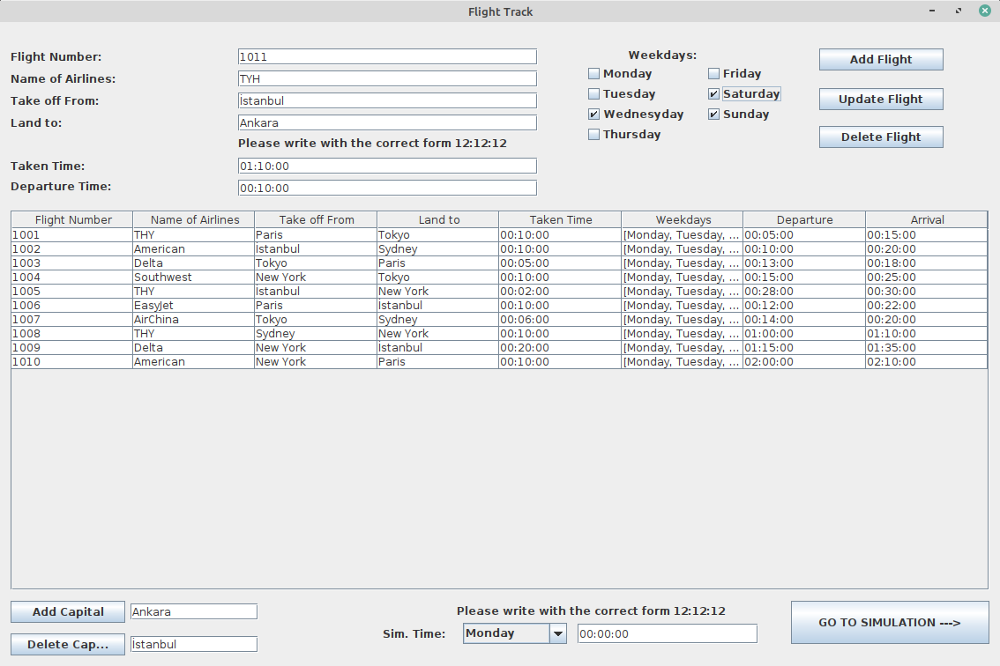
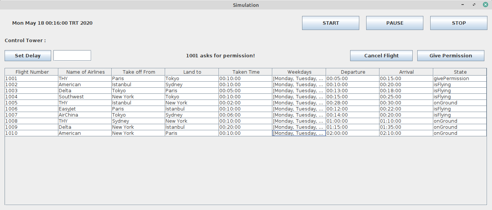

# Flight-Track-App
  Java implementation of Flight Track App
  ## How It Works
  I used Swing for the GUI. 
  Multithereaded programming to control every flight individually. 
  Lastly I used event-driven programming techniques for all program. 
  
  ## First Frame (Flights Prepared)
  1- You can add new flights and you can update already occurs 
  2- You can delete the flights 
  3- You can add new capitals or delete existing capitals 
  Then you have to give a starting point for the simulation
  ### 
  
  
  ## Second Frame (Simulation)
  Just start the simulation and follow the state column, then give permission if the flight asks for it.  
  1- You can set some delay the selected flight 
  2- You can cancel selecten flight 
  3- You can give permission if the flight asks for permission to land 
  4- You can start the similation time, pause the time and stop the time. 
  ###
  
